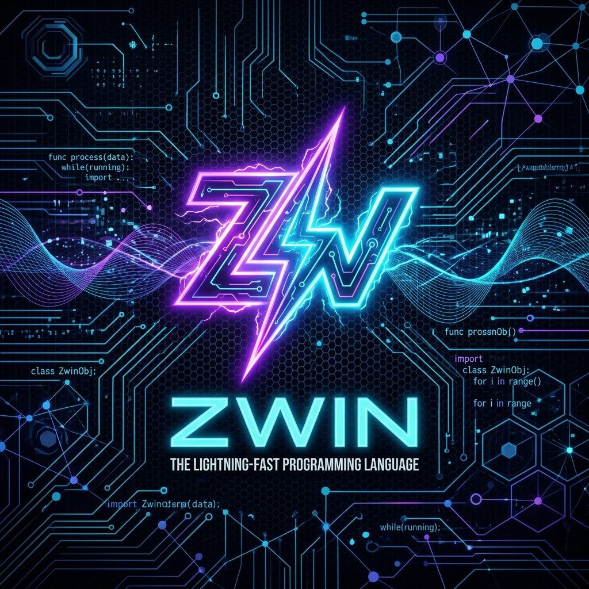
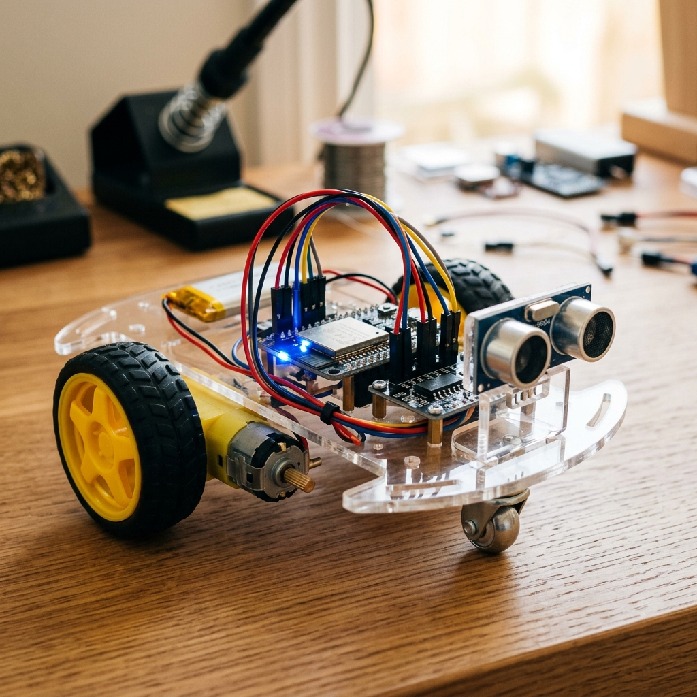

# ⚡ Zwin: AI-Native Scripting Language & VM

<p align="center">
  
</p>

Zwin is an ultra-lightweight, memory-safe, interpreted scripting language and virtual machine (VM) designed specifically for **AI Agents (LLMs)** running on resource-constrained edge hardware like the **ESP32** (microcontrollers) and other embedded systems.

---

## 🚀 Why Zwin?

1. **AI-Generated Safety (The Sandbox):** Unlike compiled languages (C++/Rust) or native scripts (Python/Bash) where an LLM bug can cause a division-by-zero crash, stack overflow, or memory panic, the **Zwin VM catches all execution errors safely**, printing the traceback back to the AI and keeping the edge device running.
2. **Ultra-Lightweight Footprint:** The C++ Zwin VM runs in **under 2 KB of RAM** and consumes less than 15 KB of flash storage, outperforming general scripting runtimes.
3. **On-the-Fly Execution:** Execute raw text scripts dynamically over Wi-Fi, Bluetooth, or Serial at runtime without compiling or rebooting the hardware.

---

## 📜 Language Specification & Syntax

Zwin features an event-driven, hardware-aware syntax that is simple for LLMs to generate:

```zwin
# Zwin Script: Obstacle Avoidance & Alert
call status_led.write(state=1)
var dist = call sonar.read()

if dist < 20 {
    call status_led.blink(count=5, delay_ms=100)
    call motors.stop()
    call speaker.say("Obstacle detected!")
} else {
    call motors.drive(left=150, right=150)
}
call status_led.write(state=0)
```

### Supported Flow Controls
* `call <module>.<action>(<params>)` — Executes hardware bindings or external APIs.
* `var <name> = <expr>` — Declares and updates local string/float variables.
* `if <condition> { ... } else { ... }` — Evaluates logical comparisons.
* `loop <count> { ... }` — Runs static loops with safe limits to prevent infinite locks.
* `delay(<ms>)` — Pauses script execution.

---

## 📁 Repository Structure

* `zwin_vm.h` — Core header file for the Zwin VM interpreter (ESP32 / C++).
* `zwin_vm.cpp` — C++ implementation of the Zwin VM interpreter (ESP32 / C++).
* `main.zwin` — A sample Zwin script demonstrating hardware integration and control logic.
* `zwin_pc/` — Standalone, instant-launching PC runner written in safe Rust. Enables running Zwin scripts and full agent loops (Gemini, File, Telegram) natively on PC.

---

## ⚙️ How to Build & Run

### 🔌 1. Microcontroller Installation (ESP32 / Arduino)
Copy `zwin_vm.h` and `zwin_vm.cpp` directly into your Arduino, ESP-IDF, or PlatformIO project structure:

```cpp
#include "zwin_vm.h"

ZwinVM vm;

// Define your custom hardware bindings
String led_write_cb(const String& params) {
    int state = params.indexOf("state=1") >= 0 ? 1 : 0;
    digitalWrite(LED_BUILTIN, state);
    return "1";
}

void setup() {
    Serial.begin(115200);
    vm.begin();
    
    // Register the binding with the VM
    vm.registerFunction("status_led.write", led_write_cb);
}

void loop() {
    if (Serial.available()) {
        String script = Serial.readString();
        String err;
        if (!vm.execute(script, err)) {
            Serial.printf("Zwin Error: %s\n", err.c_str());
        }
    }
}
```

### 💻 2. PC Installation (Rust VM Runner)
Navigate to `/zwin_pc` and compile the runner natively:
```bash
cd zwin_pc
cargo build --release
./target/release/zwin main.zwin
```

---

## 🤖 Hardware & PC Emulation

Zwin code is fully portable. The same `.zwin` script can run on a microcontroller (managing DC motor pulses and sonar frequencies) or on a PC (querying LLM endpoints, managing local files, or polling Telegram).

<p align="center">
  
</p>

### Microcontroller Setup (ESP32 / Claw Robot)
Mount your ESP32 board and a motor driver (like MX1508) onto a 2WD robotic car chassis. Using the registered C++ bindings, the robot can drive and sense obstacles autonomously:
```zwin
call status_led.write(state=1)
var dist = call sonar.read()
if dist < 20 {
    call motors.stop()
}
```

---

## ⚖️ License

Distributed under the MIT License. See `LICENSE` for more information.


